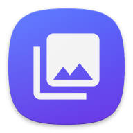

# Photos App - Displaying Photos and Videos with Jetpack Compose

Photos App Logo

The Photos App is a modern and user-friendly Android application developed using Jetpack Compose and Kotlin, following the MVVM (Model-View-ViewModel) architecture. It allows users to effortlessly browse and view both photos and videos from their device's internal storage. The app leverages the power of Jetpack Compose, a modern UI toolkit, to provide a seamless and engaging user experience.

## Key Features
- **Intuitive Navigation**: The app offers an intuitive and smooth navigation experience with a bottom navigation bar, allowing users to seamlessly switch between the Photos and Videos screens.

- **Dynamic UI Components**: Jetpack Compose's declarative syntax is used to create dynamic UI components, ensuring a consistent and visually appealing user interface across different devices.

- **Photos Grid**: The Photos Grid screen beautifully presents the user's photos in a grid layout, allowing for easy browsing and selection. Jetpack Compose animations enhance the overall interaction.

- **Videos Grid**: Users can explore and watch their favorite videos using the Videos Grid screen, providing a fluid and responsive video playback experience.

- **Search**: The app allows users to search for photos and videos by name, using the Search screen. The search results are displayed in a grid layout, similar to the Photos Grid screen.

- **Audio List**: The Audio List screen displays all the audio files on the user's device, allowing them to play and manage their audio files.


## Code Sample - HomeScreen

```kotlin

@Composable
fun HomeScreen(
    navHostController: NavHostController,
    photosViewModel: PhotosViewModel,
    videoViewModel: VideoViewModel,
    audioViewModel: AudioViewModel,
) {
    val context = LocalContext.current
    val currentScreen = rememberSaveable { mutableStateOf(Screens.HomeScreen.route) }
    val showAlertDialog = rememberSaveable { mutableStateOf(false) }
    val bottomBarVisibility = rememberSaveable { mutableStateOf(true) }
    val confirmDelete = rememberSaveable { mutableStateOf(false) }
    val totalSelectedImages by photosViewModel.selectedImages.collectAsStateWithLifecycle()
    val totalSelectedAudios by audioViewModel.selectedAudios.collectAsStateWithLifecycle()
    val totalSelectedVideos by videoViewModel.selectedVideos.collectAsStateWithLifecycle()
    val photosSelectionInProgress = totalSelectedImages > 0
    val audioSelectionInProgress = totalSelectedAudios > 0
    val videoSelectionInProgress = totalSelectedVideos > 0
    val bottomSheetVisible =
        photosSelectionInProgress || audioSelectionInProgress || videoSelectionInProgress
    val memorySize = getTotalMemorySize(photosViewModel, audioViewModel, videoViewModel, context)
    val imageScreenListState = rememberLazyListState()
    val videoScreenListState = rememberLazyListState()
    val audioScreenListState = rememberLazyListState()
    val trashLauncher = rememberLauncherForActivityResult(
        contract = ActivityResultContracts.StartIntentSenderForResult()
    ) { result ->
        trashResult(
            result,
            audioSelectionInProgress,
            audioViewModel,
            context,
            videoSelectionInProgress,
            videoViewModel,
            photosViewModel
        )
    }

    HomeScreenContent(
        currentScreen,
        navHostController,
        photosViewModel,
        bottomBarVisibility,
        imageScreenListState,
        showAlertDialog,
        videoViewModel,
        audioViewModel,
        audioScreenListState,
        videoScreenListState,
        audioSelectionInProgress,
        videoSelectionInProgress,
        totalSelectedAudios,
        photosSelectionInProgress,
        totalSelectedImages,
        totalSelectedVideos,
        bottomSheetVisible,
        memorySize,
        context,
        trashLauncher,
        confirmDelete
    )
}
```


## MVVM Architecture
 The Photos App follows the MVVM (Model-View-ViewModel) architecture:
 
- **Model**: Represents the data and business logic of the app. Manages data retrieval from internal storage.

- **View**: Declares the UI components and their layout using Jetpack Compose. Observes ViewModel data for dynamic updates.

- **ViewModel**: Manages and holds the UI-related data. Provides data to the View using LiveData or State.

## Video Playback with Media3 ExoPlayer
The app uses the Media3 ExoPlayer library to provide a seamless video playback experience:

- **VideoPlayer**: Custom Jetpack Compose composable for displaying and controlling video playback.
- **PlaybackPositionController**: Manages the playback position and state for video playback.
## Getting Started
To use the Photos App:

1. Clone the repository: git clone https://github.com/manish381364/Photos.git
2. Open the project in Android Studio.
3. Build and run the app on an Android device or emulator.
   
## Dependencies
- *Jetpack Compose*: A modern Android UI toolkit for building native UIs.
- *Kotlin*: A powerful and expressive programming language for Android development.
- *Android Architecture Components*: Used for ViewModel and LiveData management.
- *Media3 ExoPlayer*: Library for media playback and streaming.
- *Glide*: Image loading library for Android.
- *Material Components*: Material Design components for Android.
- *Accompanist*: A collection of extension libraries for Jetpack Compose.
- *Kotlin Coroutines*: Asynchronous or non-blocking programming for Android.
- *Kotlin Flow*: A stream of data that can be computed asynchronously.
- *hilt*: Dependency injection library for Android.
- *Room*: Persistence library for storing and managing data in an SQLite database.
  
## Contribution
Contributions to the Photos App are welcome! If you find any issues or want to enhance the app, feel free to submit a pull request.

License
This project is licensed under the MIT License - see the [LICENSE](License.txt) file for details.

# MIT License

🌟 **Permission is hereby granted, free of charge**, to any person obtaining a copy
of this software and associated documentation files (the "Software"), to deal
in the Software without restriction, including without limitation the rights
to use, copy, modify, merge, publish, distribute, sublicense, and/or sell
copies of the Software, and to permit persons to whom the Software is
furnished to do so, subject to the following conditions:

🌟 **The above copyright notice and this permission notice shall be included in all
copies or substantial portions of the Software.**

**THE SOFTWARE IS PROVIDED "AS IS", WITHOUT WARRANTY OF ANY KIND, EXPRESS OR
IMPLIED, INCLUDING BUT NOT LIMITED TO THE WARRANTIES OF MERCHANTABILITY,
FITNESS FOR A PARTICULAR PURPOSE AND NON-INFRINGEMENT. IN NO EVENT SHALL THE
AUTHORS OR COPYRIGHT HOLDERS BE LIABLE FOR ANY CLAIM, DAMAGES OR OTHER
LIABILITY, WHETHER IN AN ACTION OF CONTRACT, TORT OR OTHERWISE, ARISING FROM,
OUT OF OR IN CONNECTION WITH THE SOFTWARE OR THE USE OR OTHER DEALINGS IN THE
SOFTWARE.**

